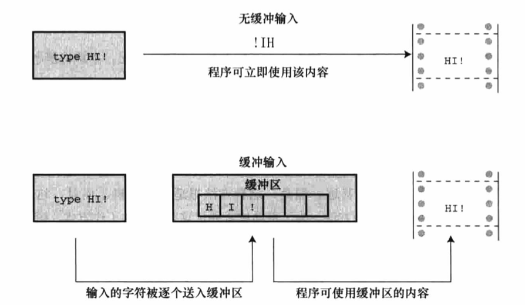

## 第八章 字符输入/输出和输入验证

## 1. 单字符I/O：`getchar()`和 `putchar()`

`getchar()` 和 `putchar()` 每次都只处理一个字符。
注意点：`getchar()`和`scanf()`函数的区别用法

`getchar()`读取`每个字符`，`包括空格、制表符和换行符`。

`scanf()`在读取数字时，则会`跳过空格、制表符和换行符`。
### 1.1 缓冲的概述
用户输入的字符被收集并储存在一个叫做 **缓冲区** 的`临时存储区`，按下Enter之后，程序才可以使用用户输入的字符。



- **缓冲输入**：按下Enter之前，不会重复打印刚输入的字符，这种类型叫做缓冲输入。
- **无缓冲输入**：回显用户输入的字符后立即重新打印该字符的就是输入无缓冲。

## 缓冲分为两类

- **完全缓冲I/O**：当缓冲区被`填满`时猜刷新缓冲区（内容被发送至目的地），通常出现在`文件输入`中。

缓冲区的大小取决于系统，常见的大小是`512 字节`。

- **行缓冲I/O**：出现在`换行符`时刷新缓冲区。`键盘输入`通常是 行缓冲输入。按下Enter键就会刷新缓冲区。
## 2. 文件、流和键盘输入

### 2.1 文件
**文件（file）** 是存储器中储存信息的区域。

文件保存在某种`永久存储器`中（如硬盘、U盘或DVD等）。

C语言中有许多用于`打开、读取、写入和关闭文件`的库函数。

#### 两个层次去分析：

- 较低层面
  - C可以使用主机操作系统的基本文件工具直接处理文件。
  - 直接调用操作系统的函数叫做`底层I/O（low-level I/O）`。
  - 系统不同，所以不可能为普通的底层创建标准库。
  
- 较高层面
  - 通过标准`I/O（standard I/O package）`来处理文件。
  - 创建用于处理文件的标准模型和一套I/O函数。

从概念上来讲，C程序处理的是流而不是直接处理文件。

### 2.2 流（stream）

流（stream）是一个实际输入或输出映射的理想化数据流。意味着不同的属性和不同种类的输入，由属性更统一的流来表示。

### 2.3 文件的结尾
计算机操作系统要以某种方式判断文件的开始和结束。

检测文件结尾的方法：在文件末尾放一个特殊的`字符标记文件结尾`。

操作系统使用的另一种方法：储存文件大小的信息。

在C语言中，使用`getchar()`读取文件检测结尾时将返回一个特殊的值，即：`EOF（end of file的缩写）`。

scanf()函数检测到文件`结尾`时也返回`EOF`。

通常，EOF定义在stdio.h文件中：

```c
#define EOF (-1)
```
> 为什么是-1？----------> -1 都不对应任何字符集，所以，使用-1作为标记文件的结尾。

`getchar()`函数的返回值通常介于`0 ～ 127`,对应的值都对因相应的字符集。

### 2.4 文件结尾`EOF`的问题
```c
#include<stdio.h>

int main(void)
{
    int ch;

    while((ch = getchar()) != EOF)
        putchar(ch);
    
    return 0;
}
```

程序的解析：
- 不用定义，因为stdio.h中已经定义。
- 不用管EOF的实际值，在stdio.h中用#define预处理器指令定义，可直接使用，不用再编写代码假定EOF为某一个值。