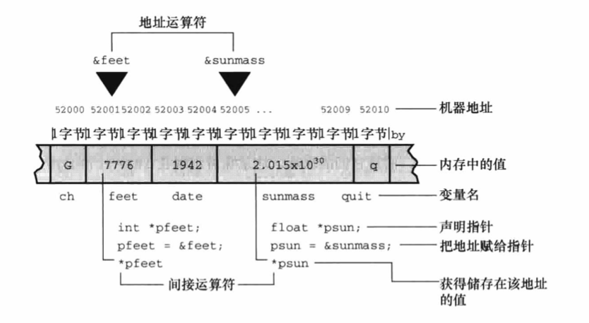

## 第九章 函数

### 👉【[复习题](./复习题.md)】【[编程练习题](./编程题.md)】
## 1.函数相关概念
`函数原型（function prototype）`告诉编译器函数的类型。

`调用函数(function call)`：执行函数。

`定义函数（function definition）`：明确函数要做什么。

使用函数之前，要用ANSI C形式声明函数原型。当函数接受参数时，函数原型用逗号分隔的列表指明参数的数量和类型。

用符号常量作为参数，实际参数（actual argument）简称`实参`。

`形式参数（formal argument）`简称`形参`。

和定义在函数中变量一样，`形式参数`也是`局部变量`，属该函数私有。

在ANSI C要求在每个变量前都要声明其类型。

圆括号中只有`参数名列表`，而参数的类型在后面声明。

注意点：普通的局部变量在`左花括号`之后声明。
## 2. 函数原型问题

声明函数的类型，不用声明任何参数。

主调函数把它的参数储存在被称为`栈（stack）`的临时存储区，被调函数从栈中读取这些参数。

针对参数不匹配的问题，ANSI C标准要求在函数声明时还要声明变量的类型，即使用函数原型（function prototype）来声明函数的返回类型，参数的数量和每个参数的类型。

错误和警告的区别：`错误`导致`无法编译`，而`警告`仍然`允许编译`。

### 2.1 无参数和未指定参数
假设函数原型为：

```c
void print_name(void);
```

一个支持ANSI C的编译器会假定用户没有用函数原型来声明函数，不会检查参数。为了表明函数没有参数，应该在`圆括号`中使用`关键字`。

```c
void print_name(void);
```

支持ANSI C的编译器解释为print_name()不接受任何参数。然后在调用该函数时，编译器会检查以确保没有使用参数。

### 2.2 函数原型的优点
函数原型是C语言不错的工具，能让编译器捕获在使用函数时可能出现的许多错误或纰漏。


## 3. 递归

### 3.1 什么是递归？

函数`自己调用自己`。这个调用过程就是`递归（recursion）`。

递归方案更简洁，但是效率不如循环。

### 3.2 递归函数的基本原理

- 每级函数调用都有自己的变量。
- 每次函数调用都会返回一次
- 递归函数中位于递归调用之前的语句，均按被调函数的顺序执行。
- 递归函数只能位于递归调用之后的语句，均按被调函数相反的顺序执行。
- 虽然每级递归都有自己的变量，但是并没有拷贝函数的代码，程序按顺序执行函数中的代码，而递归函数就相当于从头开始执行函数的代码。
- 递归函数必须包含能让递归调用停止的语句。通常是递归函数都使用if或其他等价的测试条件在函数形参等于某个特定值时终止递归。所以，每次递归调用的形参都要使用不同的值。

### 3.3 尾递归
把递归调用置于`函数末尾`，即正好在`return语句之前`，此类型的递归称为`尾递归`。

### 3.4 递归的优缺点
- 优点
    - 为某些编程问题提供了最简单的解决方案。
- 缺点
    - 会快速消耗计算机的内存资源。
    - 不方便阅读和维护。

常见递归的例子：斐波那契数列。

## 4. 指针简介
指针（pointer）：一个值为内存地址的变量（或数据对象）。

**指针变量的值是：地址**。

```c
ptr = &bah;  // 把ptr指向bah。

//ptr是可修改的左值，而&bah是右值。

// ptr的值是bah的地址。
```
> 要创建指针变量，先要声明指针变量的类型。

### 4.1 声明指针
声明指针变量时必须指定指针所指向变量的类型，因为不同的变量类型占用不同的存储空间，一些指针操作要求知道操作对象的大小。

声明示例：

```c
int *pi; // pi 是指向int类型变量的指针
char *ch; // ch 是指向char类型变量的指针
float *f1,*f2; // f1、f2都是指向float类型变量的指针
```

`类型说明符`表明了指针所指向对象的类型，`（*）`表明声明的变量也是一个`指针`。



`(*)`和`指针`之间的`空格可有可无`，通常情况下，在`声明`是`使用空格`，在`解引用变量`时`省略空格`。

对于ANSI C标准而言，直接提供了 `%p` 格式的转换说明。

### 4.2 间接运算符：`*`

假设ptr指向bah。如下：

```c
ptr = &bah;
```

使用`间接运算符*（indirection operator）`找出储存在bah中的值，该运算符也称为`解引用运算符（dereferencing operator）`。

**注意点**：不要把`间接运算符` 和 `二元乘法运算符（*）`混淆，使用的符号虽然相同，但语法功能不相同。


```c
val = *ptr; // 找出ptr指向的值
```

语句`ptr = &bah;` 和 `val = *ptr;` 放在一起等于以下的语句：

```c
val = *ptr;
```

### 4.3 总结：与指针相关的运算符

#### 地址运算符：`&`
一般注解：

后面跟一个变量名，`&` 给出该变量的地址。

```c
&number 表示变量number的地址
```
#### 地址运算符：`*`
一般注解：

后跟一个指针名或地址时， `*`  会给出储存在指针指向地址上的值。

```c
number = 10;
ptr = &number; // 指向number的指针
val = *ptr; // 把ptr指向的地址上的值赋给val
```
最终，把 ` 10 `赋给 `val`。


## 5. 函数小结

### 5.1 形式
典型的ANSI C函数的定义形式为：

```c
返回类型 名称(形参声明列表)
    函数体

形参声明列表是用逗号分隔的一系列变量声明。除了形参变量外，函数的其他的变量均在函数体的花括号之内声明。
```

```c
int diff(int x,int y)
{ // 函数体开始
    int z; // 声明局部变量 
    z = x - y;
    return z; // 返回一个值
} // 函数体结束
```

### 5.2 传递值
实参用于把值从`主调函数`传递给`被调函数`。

如果变量 a = 5 和 b = 2; 那么调用

```c
c = diff(a,b);
```
把 5 和 2 分别传递给变量 x 和 y。

5 和 2 就称为 **实际参数（简称实参）** 。`diff()函数`中定义的变量 x 和 y 称为**形式参数（简称形参）**。

被调函数一般不会改变主调函数中的变量，如果要改变，应使用指针作为参数。

### 5.3 函数的返回类型
函数的返回类型指的是`函数返回值的类型`。如果`返回值`的类型与`声明`的返回类型`不匹配`，返回值将被转换成函数声明的返回类型。

#### 5.4 函数签名
函数的`返回类型`和`形参列表` 构成了函数签名。

函数签名指定了传入函数的值的类型和函数返回值的类型。

```c
double duff(double, int)  // 函数原型

int main(void)
{
    double q,x;
    int n;
    ...
    q = duff(x,n);
}

double duff(double u, int k) // 函数的定义
{
    double tor;
    ...
    return tor; // 返回double类型的值 
}

```
