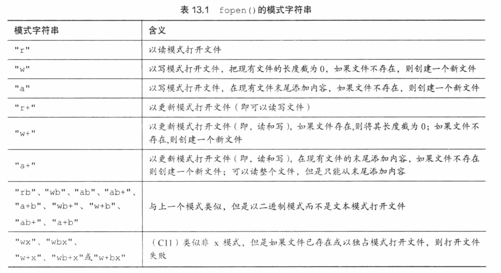

## 第十三章 文件输入/输出

### 👉【[复习题]()】【[练习题]()】
文件用于 `存储程序、文档、数据、书信、表格、照片、视频` 等。
### 1. 与文件进行通信
文件：通常是在磁盘或固态硬盘上的一段已命名的存储区。

C语言提供两种文件模式：`文本模式` 和 `二进制模式`。

**所有文件的内容都以`二进制形式（0或1）`存储**。

### 2. 标准I/O
C程序会自动打开3个文件：**`标准输入（standard input）`**、**`标准输出（standard ouput）`**、**`标准错误输出（standard error output）`**。

|标准文件|文件指针|通常使用的设备|
|:--:|:--:|:--:|
|标准输入|stdin|键盘|
|标准输出|stdout|显示器|
|标准错误|stderr|显示器|

标准I/O的好处：
- 可移植
- 有专门的函数简化了处理不同I/O的问题
- 输入和输出都是缓冲（缓冲极大提高数据传输速率）。

在打开文件时，程序一定要判断文件是否打开成功。
```cpp
if(fopen==NULL){ 
    ...
    exit(EXIT_FAILURE);
}
```
> 一旦打开失败，直接会终止后续操作。

`exit() 函数` 关闭所有打开的文件并结束程序。

在stdlib.h头文件中：
>标准要求 `0 `或 宏 `EXIT_SUCCESS`：表明成功结束程序。
>
>宏 `EXIT_FAILURE`：表明结束程序失败。

#### 2.1 `fopen()` 和 `fclose()` 函数
都声明在 `stdlib.h` 头文件中。

|函数|函数原型|语法格式|功能|备注|
|:--:|:--|:--|:--|:--|
|`fopen()`|`FILE *fopen(const char *filename,const char * mode);`|`FILE *fp = fopen("filename",mode)`|打开文件|返回一个文件指针：FILE *fp 指向一个记录文件信息的数据结构<br>例：`fp = fopen("hello_c.txt","r");`|
|`fclose()`|`int fclose(FILE * stream);`|`fclose(fp)`|关闭文件|关闭成功返回0，失败返回EOF(-1)，存储空间不足或者被移除都会出现I/O错误，都会导致失败。|
>文件指针的类型是指向FILE的指针，FILE是一个定义在 `stdlib.h` 中的`派生类型`。

mode的内容参考：



#### 2.2 `getc()` 和 `putc()` 函数
与 `getchar()` 和 `putchar()` 函数类似。

区别：
>需要告知 `getc()` 和 `putc()` 函数 使用哪一个文件。

|函数|函数原型|语法格式|功能|备注|
|:--:|:--|:--|:--|:--|
|`gets()`|`int getc(FILE *stream)`|`ch = getc(fp)`|从fp指定文件中获取一个字符，读到文件结尾返回EOF|`getc(stdin) == getchar(ch);`|
|`putc()`|`int putc(int char,FILE *stream)`|`putc(ch,fp)`|把ch放入fp指向文件|`puts(ch,stdout) == putchar(ch);`|


### 3. 文件I/O

### 4. 随机访问


### 5. 其他I/O函数


