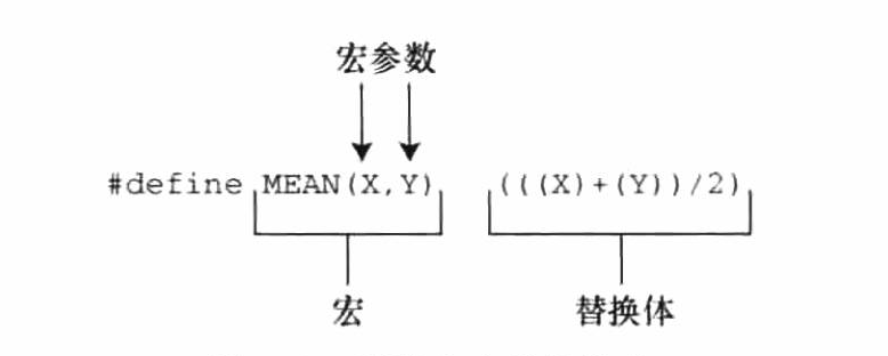

## 第十六章 C预处理器和C库

### 👉【[复习题](./复习题.md)】【[编程练习题](./编程题.md)】

### 1. 翻译程序工具 ----> 编译器
在预处理之前，编译器会做一些翻译处理工作。

- 把源代码中出现的`字符`映射到`源字符集`。
- 定位每个`反斜杠`后面跟着`换行符的实例`，并直接删除。
>将物理行转换成逻辑行。
```cpp
printf(“That's wond\
        erful!\n")； 
```
转成
```cpp
printf(“That's wonderful!\n");
```

- 编译器把`文本`划分成`预处理记号序列`、`空白序列` 和 `注释序列`（记号是由空格、制表符或换行符分隔的项）。

⚠️注意：编译器会用一个`空格字符`替换`每一条注释`。
```cpp
int /*这看起来不像是一个空格*/ fox;
```
将变成
```cpp
int fox;
```

### 2. 明示常量：`#define`
`#define预处理器` 指令 和 `其他预处理器`指令一样，以 `# `作为一行的开始。
>ANSI 和后来标准都允许 `#` 前面有`空格`或 `制表符`，也允许在 `#` 和指令的其余部分之间有空格。

⚠️注意：指令长度仅限于一行（从#开始运行，到后面的第一个换行符为止）。

#### 2.1 每行 `#define（逻辑行）`的3部分
- `#define`指令本身
- 选定的缩写，也称为`宏`。
    > 宏代表值称为`类对象宏`。
    >
    > 宏的名称中不允许有空格。遵循C变量的命名规则。
- 替换列表或替换体。
    > 从宏替换文本的过程称为`宏展开`。

⚠️注意：可在`#define`行使用标准C注释。

宏可以表示任何字符串，也可表示整个C表达式。

~~预处理器不做计算，不对表达式求值~~ ，只替换字符序列。

### 3. 在`#define`中使用参数

用#define创建类似函数的类函数宏,~~~不是函数~~。

类函数宏定义的圆括号可以有一个或多个参数，随后参数出现在替换体中。

> MEAN 是宏标识符

**函数调用和宏调用的区别**
- 函数调用：在`程序运行时`把参数的值传递给函数。
- 宏调用`在编译之前`把参数记号传递给程序。

⚠️注意：必要时使用足够多的圆括号来确保运算结合的正确顺序。

~~不要在宏中使用递增或递减运算。~~

#### 3.1 用宏参数创建字符串：`#运算符`
例：
```c
#define PSQR(X) printf("The square of X id %d .\n",((X)*(X)));
```
> 双引号字符串中的X视为普通文本，而不是可被替换的记号。

C允许在字符串中包含宏参数。在类宏函数的替换体中，`#号`作为一个`预处理运算符`，可以把记号转化为`字符串`，这样的过程叫作`字符串化（stringizing）`。例如，双引号中想表示宏形参，则使用 `#X` 即可。

#### 3.2 预处理器粘合剂：`##运算符`
可用于`类函数宏`和`对象宏`的替换部分。把两个记号组合成一个新的标识符。

#### 3.3 变参宏：`...` 和 `__VA_ARGS__`
通过把`宏参数列表`中最后的参数写成`省略号（即3个点...）`来实现这一功能。`预定义宏__VA_ARGS__`可用于替换部分中，表明省略号代表什么。

格式：
```c
#define PR(...) printf(__VA_ARGS__)
```
C99/C11对宏提供让用户自定义带可变参数的函数。由 `stdvar.h 头文件`提供。

⚠️记住：省略号只能代替最后的宏参数。

### 4. 宏和函数的选择
#### 4.1 如何选择？
- 使用宏比普通函数更复杂一些，稍有不慎会有副作用。（一些编译器规定宏只能定义成一行）
- 需要注意时间和空间的制衡。
    - 宏生成内联代码，在程序中生成语句。函数调用无论多少次，程序中只有一份函数语句的副本，节省了空间。
    - 程序的控制必须跳转到函数内，随后再返回主调函数，这比内联代码花费更多时间。
- 对于简单的函数，程序员通常使用宏

#### 4.2 宏的注意点
- 宏名不允许有空格，但替换字符中可以有空格。
- 圆括号把宏的参数和整个替换体括起来，能确保被括起来的部分在表达式正确展开。
- `大写字母表示宏函数的名称`（大写字母可以提醒程序员可能产生副作用）。例如：`MAX(X,Y)`
- 如果打算使用宏加快程序运行速度，首先要确定使用宏和使用参数是否会导致较大的差异。
> 在程序中使用一次的宏无法明显减少程序的运行时间，在嵌套循环中使用宏更有助于提高效率。

### 5. 文件包含：`#define`


